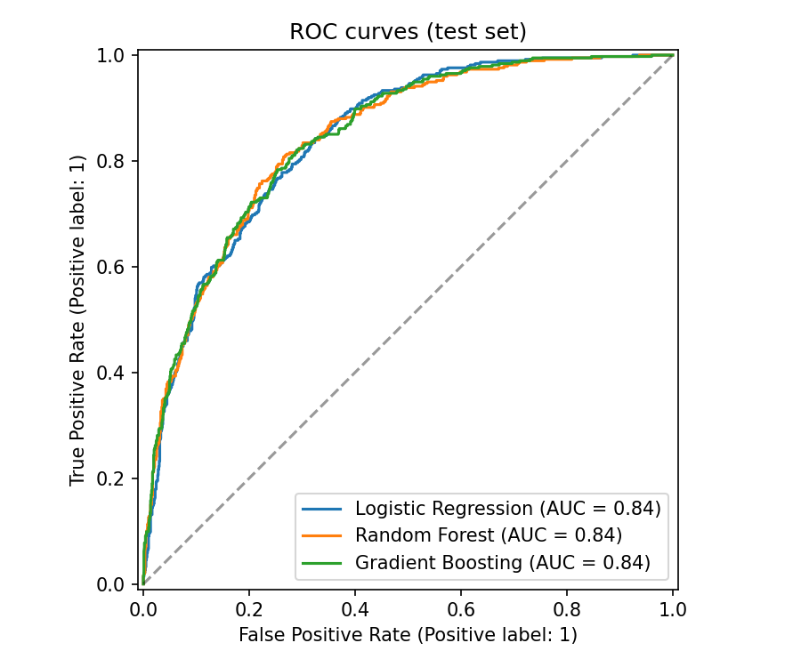
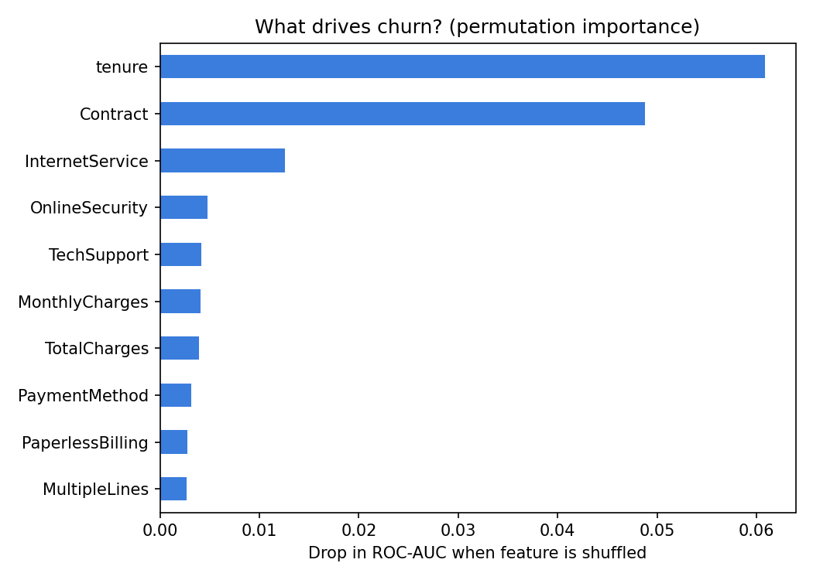
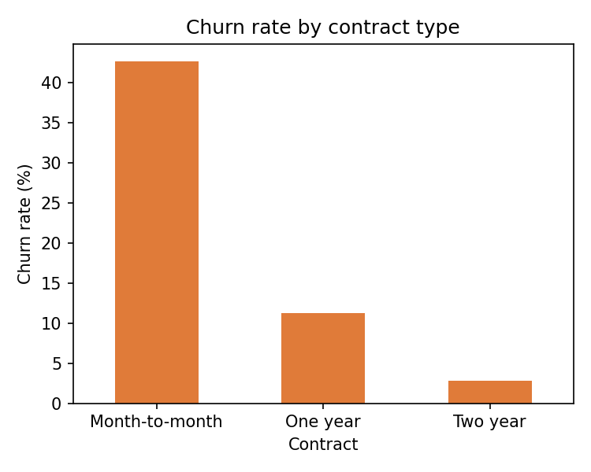
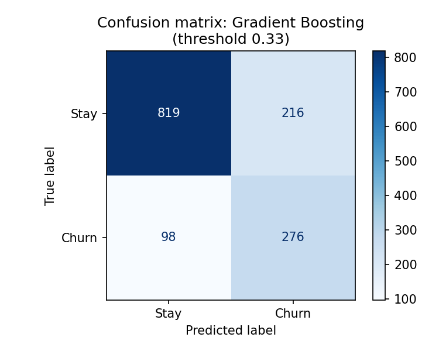

# 📉 Customer Churn Prediction

An end-to-end machine learning project in Python that predicts whether a telecom customer will leave (churn), compares several models, explains what drives churn, and serves predictions through a Streamlit web app.

### 🌐 Live app: [yuxyyy.streamlit.app](https://yuxyyy.streamlit.app)

[](https://yuxyyy.streamlit.app)

**Built by yuxyyy** · Website: [`docs/index.html`](docs/index.html) (landing page that embeds the app)

## Features
- Data cleaning and preprocessing with a scikit-learn `Pipeline` (scaling + one-hot encoding); 11 blank `TotalCharges` rows (new customers) are kept as 0 instead of dropped
- 5-fold cross-validation, `GridSearchCV` hyperparameter tuning, and decision-threshold tuning chosen on training data only (no test-set leakage)
- Model comparison: Logistic Regression, Random Forest, Gradient Boosting
- Handles class imbalance (`class_weight="balanced"`) and evaluates with precision, recall, F1 and ROC-AUC, not just accuracy
- Charts: ROC curves, confusion matrix, feature importance
- Interactive Streamlit app for single-customer predictions, live at **yuxyyy.streamlit.app**
- Branded landing page (`docs/index.html`) that opens and embeds the app

## Project structure
```
churn-prediction/
├── app.py                      # Streamlit web app (branded yuxyyy.streamlit)
├── requirements.txt
├── .streamlit/
│   └── config.toml             # app theme
├── docs/
│   └── index.html              # landing page / website that embeds the app
├── data/
│   ├── README.md
│   └── Telco-Customer-Churn.csv
├── src/
│   └── train.py                # train, compare, tune, evaluate, save best model
├── models/                     # saved model (created by train.py)
└── reports/                    # charts and metrics (created by train.py)
```

## Setup
```bash
git clone https://github.com/<your-username>/churn-prediction.git
cd churn-prediction
python -m venv .venv
source .venv/bin/activate        # Windows: .venv\Scripts\activate
pip install -r requirements.txt
```

## Dataset
The real **Telco Customer Churn** dataset (IBM sample data, 7,043 customers, 26.5% churn) is included at `data/Telco-Customer-Churn.csv`.

## Run
```bash
python src/train.py      # trains models, writes charts to reports/, saves models/churn_model.joblib
streamlit run app.py     # opens the web app in your browser
```

## Results
Held-out test set (20% of customers, stratified). Full table in `reports/model_comparison.csv`.

| Model | CV ROC-AUC | Accuracy | Precision | Recall | F1 | ROC-AUC |
|-------|-----------|----------|-----------|--------|----|---------|
| Logistic Regression | 0.846 | 0.738 | 0.504 | 0.783 | 0.614 | 0.842 |
| Random Forest | 0.845 | 0.772 | 0.552 | 0.749 | 0.636 | 0.843 |
| Gradient Boosting | 0.848 | 0.803 | 0.666 | 0.516 | 0.581 | 0.843 |
| **Gradient Boosting (tuned, threshold 0.33)** | 0.850 | 0.777 | 0.561 | 0.738 | 0.637 | **0.846** |

Lowering the decision threshold from 0.50 to 0.33 raises churn recall from about 0.51 to 0.74, so the model catches far more customers who are about to leave, at the cost of some precision.






## Website and deployment (yuxyyy.streamlit)
The app is published on **Streamlit Community Cloud** at **https://yuxyyy.streamlit.app**, and `docs/index.html` is a landing page that links to it and embeds it.

To publish it yourself:
1. Push this project to GitHub. Run `python src/train.py` first and commit `models/churn_model.joblib` too, or the hosted app will say the model is missing.
2. Go to [share.streamlit.io](https://share.streamlit.io), click **Create app**, pick the repo, branch `main` and main file `app.py`.
3. Under **Advanced settings**, set the custom subdomain to `yuxyyy` so the address becomes `yuxyyy.streamlit.app` (if it is taken, choose another and update the links in `README.md`, `app.py` and `docs/index.html`).
4. Optional landing page: in the GitHub repo go to **Settings → Pages**, choose the `main` branch and `/docs` folder.

## Ideas to extend
- Try XGBoost or LightGBM
- Add SHAP explanations

## Tech stack
Python, pandas, NumPy, scikit-learn, matplotlib, Streamlit, joblib, HTML/CSS (landing page)

---
Made by **yuxyyy** · [yuxyyy.streamlit.app](https://yuxyyy.streamlit.app)
